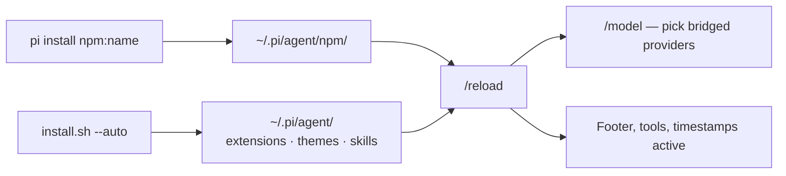
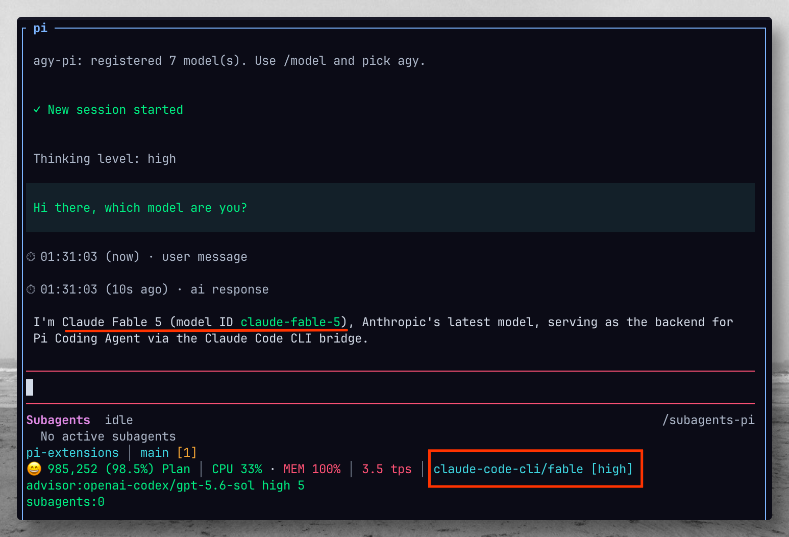
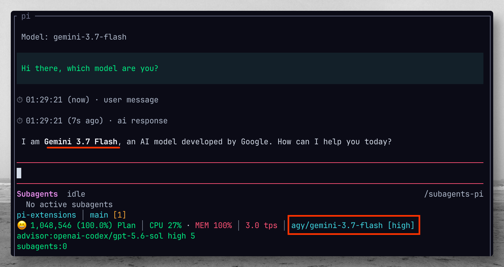
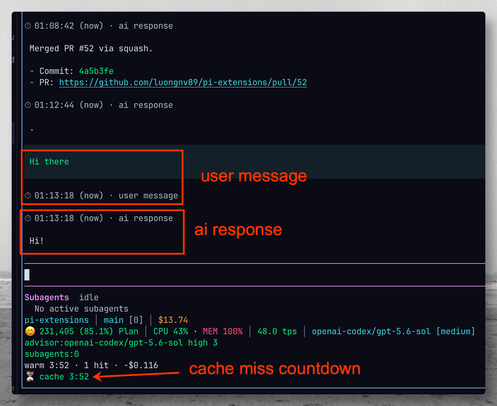
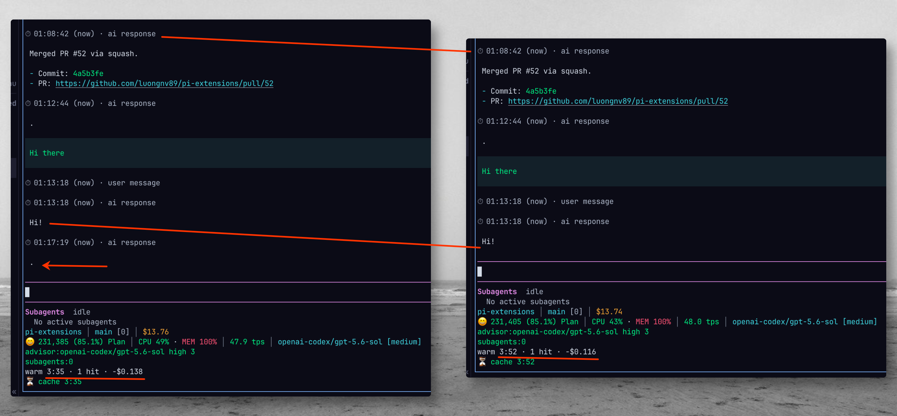

[](LICENSE)
[](https://github.com/luongnv89/pi-extensions/releases)
[](docs/DEVELOPMENT.md)

# Extend Pi with models, status, and tools — one command each

A curated collection of **12 extensions, 1 skill, and 3 themes** for
[Pi Coding Agent](https://github.com/earendil-works/pi-coding-agent).
Most install with a single `pi install npm:<name>`.

[**Browse the catalog**](#catalog) · [**Install everything**](#quick-start)

---

## Catalog

Find what you need, copy the install command, reload Pi (`/reload`).

### Providers — use external models in Pi

| Extension | What you get | Install |
|---|---|---|
| [claude-code-pi](extensions/claude-code-pi/README.md) | Claude models (`sonnet`, `opus`) via local `claude -p` | `pi install npm:claude-code-pi` |
| [grok-pi](extensions/grok-pi/README.md) | Grok CLI models: Grok 4.6/4.5, Composer 2.5 | `pi install npm:grok-pi` |
| [opencode-pi](extensions/opencode-pi/README.md) | Free OpenCode CLI models, no login required | `pi install npm:opencode-pi` |
| [agy-pi](extensions/agy-pi/README.md) | agy CLI models (Gemini, Sonnet, GPT OSS), auto-discovered | `pi install npm:agy-pi` |
| [cursor-pi](extensions/cursor-pi/README.md) | Cursor CLI models (`auto`, Composer, Codex…) via local `cursor-agent -p`, with install/auth verification | `pi install npm:cursor-pi` |
| [9router-pi](extensions/9router-pi/README.md) | 9router gateway models via `/v1/models` discovery | `pi -e ./extensions/9router-pi` (not on npm) |

### Status & UI

| Extension | What you get | Install |
|---|---|---|
| [statusline-pi](extensions/statusline-pi/README.md) | Footer: git, PR, context window, tok/s, cost, CPU/MEM | `pi install npm:statusline-pi` |
| [timestamp-pi](extensions/timestamp-pi/README.md) | Message timestamps + prompt-cache TTL countdown | `pi install npm:timestamp-pi` |
| [subagents-pi](extensions/subagents-pi/README.md) | Fleet panel for managed subagents (context, TPS, model) | `pi -e ./extensions/subagents-pi` (not on npm) |

### Tools & automation

| Extension | What you get | Install |
|---|---|---|
| [advisor-pi](extensions/advisor-pi/README.md) | `advisor` tool: strategic guidance from a stronger model | `pi install npm:advisor-pi` |
| [cache-warm](extensions/cache-warm/README.md) | Keep-alive pings that avoid prompt-cache misses (on by default, 30m idle auto-stop) | `pi install npm:cache-warm` |
| [model-debugger](extensions/model-debugger/README.md) | Log all model requests/responses for provider debugging | `pi install npm:model-debugger` |

### Skill & themes

| What | Details | Install |
|---|---|---|
| pi-delegator skill | Delegate approved tasks to a monitored Pi subprocess | repo installer or `npm run install-skills` from a clone |
| `neon-green` / `neon-green-light` themes | Futuristic dark/light pair | repo installer or manual copy ([Themes](#themes)) |
| `opencode` theme | OpenCode-branded theme | repo installer or manual copy ([Themes](#themes)) |

Published packages are also listed on [pi.dev/packages](https://pi.dev/packages).

## How It Works



Provider extensions register a Pi provider backed by a local CLI; UI extensions
hook the TUI footer and message rendering. Nothing sends extra data anywhere —
each extension's README documents exactly what it does.

## Quick Start

Pick one path:

**Single extensions from npm (recommended):**

```bash
pi install npm:statusline-pi
```

```bash
pi install npm:advisor-pi   # then /reload in Pi
```

Pin a version, install project-local, or try without installing:

```bash
pi install npm:opencode-pi@1.1.4
```

```bash
pi install -l npm:statusline-pi   # writes .pi/settings.json in this project only
```

```bash
pi -e npm:advisor-pi              # current session only
```

**Everything at once (full collection: extensions + themes + skills):**

```bash
curl -fsSL https://raw.githubusercontent.com/luongnv89/pi-extensions/main/install.sh | bash -s -- --auto
```

**From a cloned repo:**

```bash
git clone https://github.com/luongnv89/pi-extensions ~/.pi/pi-extensions
```

```bash
~/.pi/pi-extensions/install.sh --auto
```

Manage packages:

```bash
pi list
```

```bash
pi update --extensions
```

```bash
pi remove npm:advisor-pi
```

Installer flags:

| Flag | Effect |
|---|---|
| `--auto` | Skip prompts, install everything automatically |
| `--keep` | Keep the cloned repo after installation |
| `--dry-run` | Show what would be installed without copying |
| `--repo-url URL` | Use a custom repo URL (default: GitHub) |
| `--branch BRANCH` | Use a custom branch (default: `main`) |

Reload Pi after any change: type `/reload` (or restart).

## Screenshots

| | |
|:---:|:---:|
| **statusline-pi** — git, cost, CPU/MEM, context zone, tok/s | **statusline-pi** — wrapped footer on a narrow terminal |
|  |  |
| **grok-pi** — Composer 2.5 via `grok-cli` | **opencode-pi** — free OpenCode models in `/model` |
|  |  |
| **opencode-pi** — DeepSeek flash in session | **claude-code-pi** — `claude-code-cli` provider |
|  |  |
| **advisor-pi** — strategic `advisor` tool | **Codex** — example Pi session (built-in provider) |
|  |  |

More assets live in [`assets/`](assets/) (e.g. `statusline-pi-gpt-5-mini-195toks.png`, `pi-nvidia-kimi-2.6.png`).

---

## Extension details

Quick reference per extension. Full setup guides live in each extension's README.

<details>
<summary><strong>statusline-pi</strong> — custom footer</summary>

Replaces Pi's default footer with a compact project statusline.


```
current-dir │ branch [changed files] PR #x │ remaining context tokens (percentage) context zone │ average response speed │ provider/model
```

Example:

```
pi-extensions │ main [2] PR #12 │ 840,037 (84.0%) Plan │ 42.5 tok/s │ openai-codex/gpt-5.5
```

**Git section** — groups all git-related status:
- Current branch name
- Number of changed files from `git status --porcelain`
- Related GitHub PR number (when `gh pr view` resolves one)

**Context section** — remaining context window as exact tokens plus percentage, followed by the active zone:

```
840,037 (84.0%) Plan
```

Zone coloring:
- **Plan** / **Code** — success color
- **Dump** — warning color
- **ExDump** / **Dead** — error color

**Average response speed** — approximate model output speed for the current model/thinking context:

```
42.5 tok/s
```

The value averages completed assistant responses, includes the active response while streaming, and remains visible while idle.

**Commands:**

```
/statusline-pi       # Toggle the custom footer on/off
/statusline-refresh  # Force refresh git and PR data
```

</details>

<details>
<summary><strong>advisor-pi</strong> — advisor tool</summary>

Registers an `advisor` tool for strategic planning and course correction.
The executor model can ask a configured advisor model for guidance while keeping
file changes under the executor's control.


**Commands:**

```
/advisor-pi status
/advisor-pi enable
/advisor-pi disable
/advisor-pi model <provider>/<model>
/advisor-pi max-uses <number>
/advisor-pi cache <none|short|long>
/advisor-pi reset
```

**Operational notes:**

- Each advisor consultation is a separate model call and may add cost.
- Executor streaming pauses while the advisor model responds.
- Cache preferences are passed through where providers support them.
- The advisor has no tools; it only returns strategic guidance.

Full setup: [extensions/advisor-pi/README.md](extensions/advisor-pi/README.md)

</details>

<details>
<summary><strong>claude-code-pi</strong> — claude-code-cli provider</summary>

Registers the **`claude-code-cli`** provider so Pi can use Claude Code CLI model aliases such as `sonnet`, `opus`, and `fable`. Every model turn spawns the local `claude -p` command with the selected model; there is no Anthropic SDK, HTTP API, or built-in provider fallback.


```bash
pi --provider claude-code-cli --model sonnet
```

**Commands:** `/claude-code-pi status`, `/claude-code-pi models`, `/claude-code-pi test`, `/claude-code-pi help`

Full setup: [extensions/claude-code-pi/README.md](extensions/claude-code-pi/README.md)

</details>

<details>
<summary><strong>grok-pi</strong> — grok-cli provider</summary>

Registers the **`grok-cli`** provider so Pi can use the same models as the Grok CLI (including **Grok 4.6** / **4.5** and **Composer 2.5**). Authenticate with `grok login`, then pick `grok-cli` in `/model`. Reasoning models honor Pi thinking levels (`Shift+Tab`, `/settings`, `--thinking`).


```bash
pi --provider grok-cli --model grok-4.6 --thinking high
```

**Commands:** `/grok-pi status`, `/grok-pi help`

Full setup: [extensions/grok-pi/README.md](extensions/grok-pi/README.md)

</details>

<details>
<summary><strong>opencode-pi</strong> — opencode-cli provider</summary>

Registers the **`opencode-cli`** provider so Pi can use free models exposed by the local OpenCode CLI, without `opencode auth login`.


```bash
pi --provider opencode-cli --model opencode/deepseek-v4-flash-free
```

**Commands:** `/opencode-pi status`, `/opencode-pi models`, `/opencode-pi test`, `/opencode-pi help`

Full setup: [extensions/opencode-pi/README.md](extensions/opencode-pi/README.md)

</details>

<details>
<summary><strong>agy-pi</strong> — agy provider</summary>



Registers an **`agy`** provider so Pi can use models exposed by the
[agy](https://github.com/earendil-works/agy) CLI — Gemini flash/pro variants,
Claude Sonnet, GPT OSS, and more (`extensions/agy-pi/src/index.ts`). Models are
auto-discovered from `agy models` output; effort variants (`-high`/`-medium`/`-low`)
collapse into a single base model, with effort chosen via Pi's thinking-level selector.

Requires the `agy` CLI on `PATH` (`pip install agy-cli`) configured with your API keys.
Environment overrides: `AGY_PI_BIN` (binary path) and `AGY_PI_MODELS`
(comma-separated model IDs) (`extensions/agy-pi/src/index.ts:508`).

```bash
pi install npm:agy-pi   # or: pi -e ./extensions/agy-pi
```

**Commands:** `/agy-pi` — show provider status and registered models

</details>

<details>
<summary><strong>cursor-pi</strong> — cursor-cli provider</summary>

Registers the **`cursor-cli`** provider so Pi can use Cursor CLI model ids such as `auto`, `composer-2.5`, and `gpt-5.3-codex-high`. Every model turn spawns the local `cursor-agent -p --mode ask --trust` command (read-only ask mode); there is no HTTP API or built-in provider fallback. Verifies the Cursor CLI installation and login at session start with fix guidance.

```bash
pi --provider cursor-cli --model auto
```

**Commands:** `/cursor-pi status`, `/cursor-pi verify`, `/cursor-pi models`, `/cursor-pi test`, `/cursor-pi help`

Full setup: [extensions/cursor-pi/README.md](extensions/cursor-pi/README.md)

</details>

<details>
<summary><strong>9router-pi</strong> — 9router gateway provider</summary>

Registers the **`9router`** provider and discovers the current model catalog from the local gateway. Use `/9router-pi refresh` after changing enabled models; credentials stay in `~/.pi/agent/models.json`.

```bash
pi -e ./extensions/9router-pi
```

**Commands:** `/9router-pi status`, `/9router-pi refresh`, `/9router-pi help`

Full setup: [extensions/9router-pi/README.md](extensions/9router-pi/README.md)

</details>

<details>
<summary><strong>timestamp-pi</strong> — timestamps + cache countdown</summary>



Adds a dim timestamp line (with age and message type: `user
message`, `ai response`, `tool call`) under every chat message, plus a footer
countdown of the 5-minute prompt-cache TTL (`⏳ cache 4:32`) that turns green
while warm, yellow under 1 minute, and red once expired
(`extensions/timestamp-pi/src/index.ts:177`).

Timestamps are stored as custom session entries, so they survive reloads and
are rendered TUI-only — never sent to the LLM. Requires Pi >= 0.84.

```bash
pi install npm:timestamp-pi   # or: pi -e ./extensions/timestamp-pi
```

**Commands:** `/timestamp-pi` — toggle timestamps and cache countdown

</details>

<details>
<summary><strong>cache-warm</strong> — prompt-cache keep-alive</summary>



Keeps the prompt cache alive with hidden keep-alive turns.
Default is **on**: new sessions start the keep-alive timer without `/cache-warm on`.
Disable with `/cache-warm off`. Keep-alive auto-stops after 30 minutes idle
(configurable: `/cache-warm duration 1h` or `CACHE_WARM_DURATION`). Pings use `pi.sendMessage()` (not `sendUserMessage` /
`completeSimple`) and only fire when the session is idle, nothing is queued,
cache activity has already been seen, and remaining TTL is under 60 seconds
(`extensions/cache-warm/src/index.ts`). The 5-minute TTL is an Anthropic
heuristic. Metrics report warm attempts, refreshes, likely avoided misses, and
estimated net USD saved (gross cache discount minus warm-turn spend; `N/A` when
rates are missing). See [extensions/cache-warm/README.md](extensions/cache-warm/README.md).

```bash
pi install npm:cache-warm   # or: pi -e ./extensions/cache-warm
```

**Commands:** `/cache-warm on`, `/cache-warm off`, `/cache-warm` (toggle),
`/cache-warm duration [30m|1h|forever]`, `/cache-warm status`, `/cache-warm metrics`

</details>

<details>
<summary><strong>model-debugger</strong> — request logging</summary>

Logs model requests and responses to `~/.pi/agent/logs/` for debugging
provider interactions.

```bash
pi install npm:model-debugger
```

</details>

<details>
<summary><strong>subagents-pi</strong> — subagent fleet panel</summary>

Fleet metrics panel for managed subagents (context, TPS, model, thinking);
works with `@tintinweb/pi-subagents`.

```bash
pi -e ./extensions/subagents-pi
```

</details>

<details>
<summary><strong>pi-delegator</strong> — delegation skill</summary>

An agent skill that lets a main AI agent delegate a clear,
approved task to a separate Pi process. It starts by checking available Pi models,
prefers free `opencode-cli` models by default, saves a reusable default model,
streams progress, and reports duration/token/cost metrics when Pi exposes them.

```bash
python3 ~/.pi/agent/skills/pi-delegator/scripts/pi_delegate.py models --prefer-free
```

Use the skill from Pi as `/skill:pi-delegator`, or let Pi auto-load it when you
ask to delegate work to a separate Pi instance.

</details>

## Themes

Themes are automatically discovered from `~/.pi/agent/themes/`.

| Theme | Style |
|---|---|
| `neon-green` | Futuristic dark |
| `neon-green-light` | Softer light variant |
| `opencode` | OpenCode-branded |

Manual install from a clone:

```bash
cp ~/.pi/pi-extensions/themes/*.json ~/.pi/agent/themes/
```

Select a theme from Pi's `/settings`, then reload if needed.

## Updating

```bash
cd ~/.pi/pi-extensions && git pull origin main && ~/.pi/pi-extensions/install.sh --auto
```

Then run `/reload` in Pi.

## Project Structure

```text
pi-extensions/
├── extensions/                  # one package per extension (package.json + src/index.ts + README.md)
│   ├── 9router-pi/
│   ├── advisor-pi/
│   ├── agy-pi/
│   ├── cache-warm/
│   ├── claude-code-pi/
│   ├── cursor-pi/
│   ├── grok-pi/
│   ├── model-debugger/
│   ├── opencode-pi/
│   ├── statusline-pi/
│   ├── subagents-pi/
│   └── timestamp-pi/
├── skills/pi-delegator/         # SKILL.md + scripts + references
├── themes/                      # neon-green.json, neon-green-light.json, opencode.json
├── scripts/                     # packaging guard + npm publish script
├── docs/                        # DEVELOPMENT.md, DECISIONS.md
└── install.sh                   # one-command installer (--auto, --dry-run, ...)
```

## Documentation

- [Contributing Guide](CONTRIBUTING.md) — how to add extensions, themes, and submit changes
- [Developer Guide](docs/DEVELOPMENT.md) — architecture, extension API, theme schema, npm scripts, listing on [pi.dev/packages](https://pi.dev/packages)
- [Changelog](CHANGELOG.md) — release history and planned features
- [Decisions Log](docs/DECISIONS.md) — resolved documentation ambiguities
- [Security Policy](SECURITY.md) — how to report vulnerabilities

## License

MIT — see [LICENSE](LICENSE) for details.
